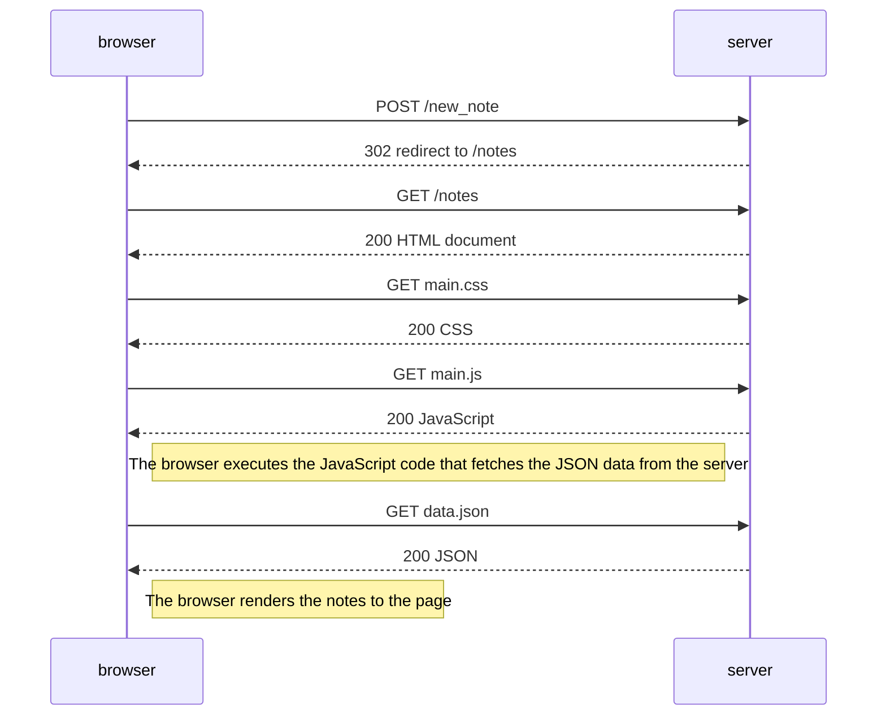

```mermaid
sequenceDiagram
    participant browser
    participant server

    browser ->> server: POST /new_note
    server -->> browser: 302 redirect to /notes

    browser ->> server: GET /notes
    server -->> browser: 200 HTML document

    browser ->> server: GET main.css
    server -->> browser: 200 CSS

    browser ->> server: GET main.js
    server -->> browser: 200 JavaScript

    note right of browser: The browser executes the JavaScript code that fetches the JSON data from the server


    browser ->> server: GET data.json
    server -->> browser: 200 JSON

    note right of browser: The browser renders the notes to the page

```